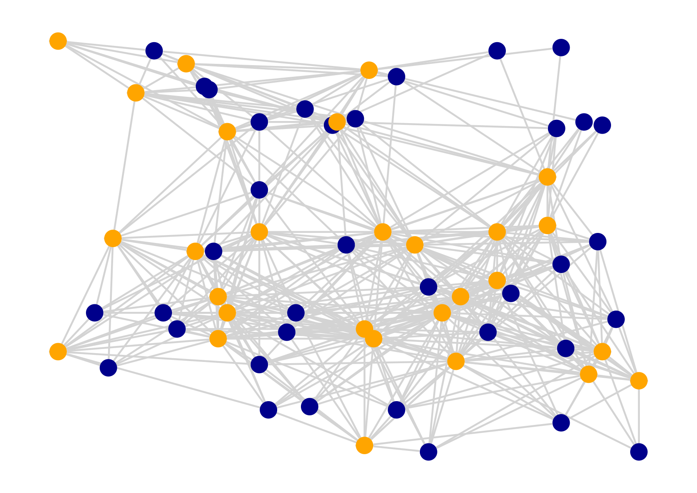

# Bluetooth LE Mesh simulation using [Agents.jl](https://github.com/JuliaDynamics/Agents.jl)



## Try it out (via [Julia 1.5](https://julialang.org/downloads/))

```bash
julia --project -e 'using Pkg; Pkg.activate(); Pkg.instantiate()' # install dependencies

julia --project run.jl
```

## Try python interface (after following the steps above)

```bash
python3 -m pip install --user julia

python3 -c "import julia; julia.install()"

python3 run.py
```
